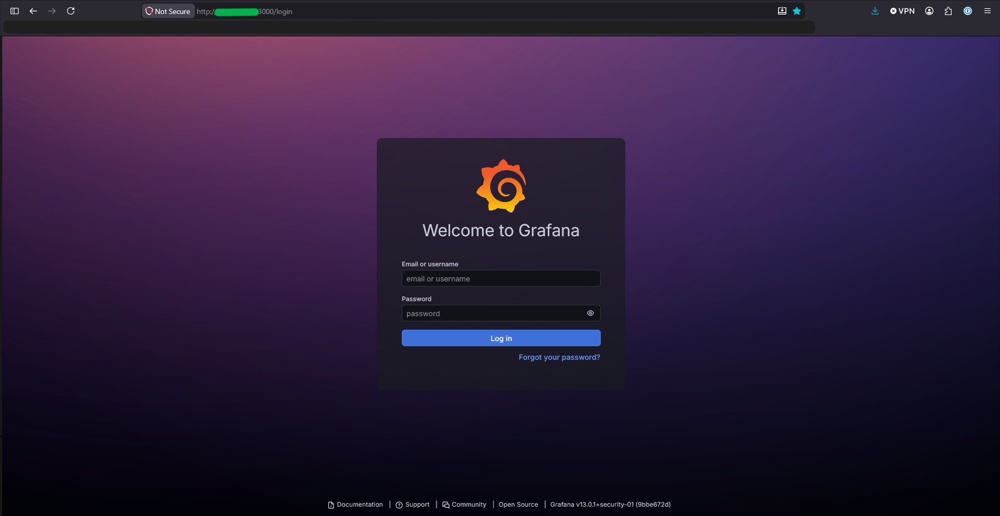
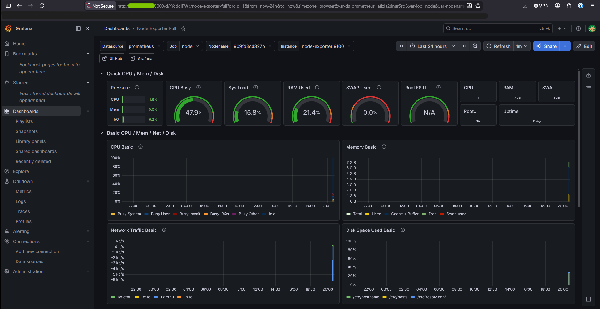
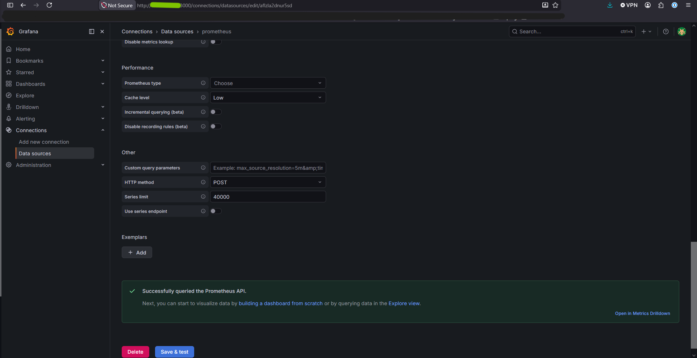
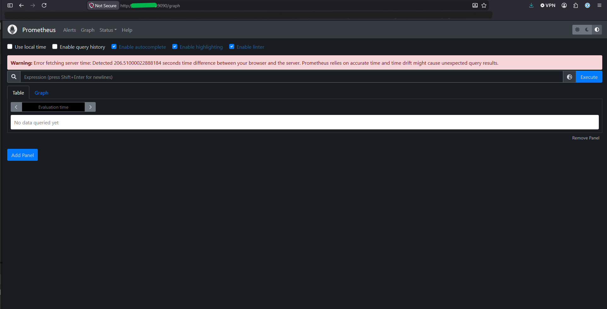
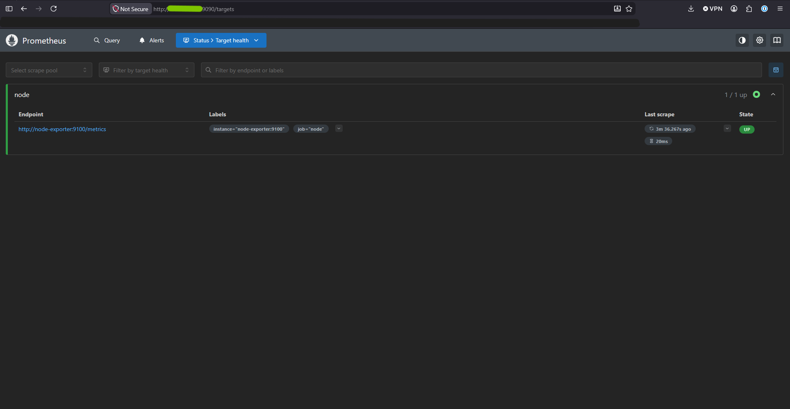
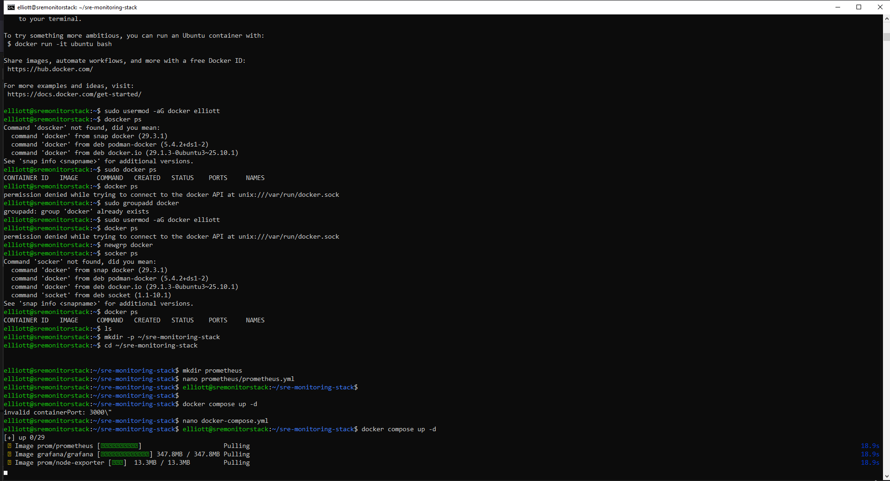
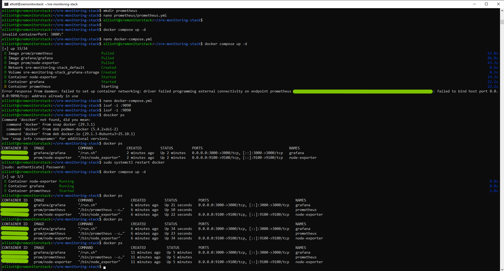
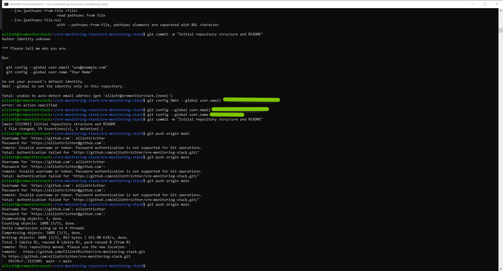
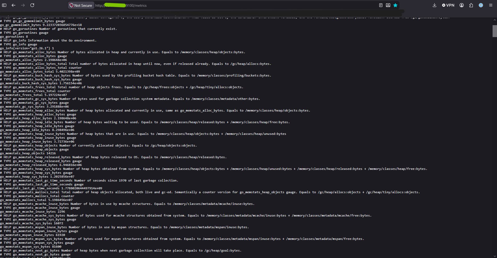

# SRE Monitoring Stack

## Abstract

Self-hosted monitoring and observability stack for SRE training built using Grafana, Prometheus, Node Exporter, and Docker Compose.

## Overview

This project is a self-hosted monitoring and observability environment created for Site Reliability Engineering training and infrastructure monitoring practice.

The goal of this project is to build a production-style monitoring stack capable of collecting metrics, visualizing infrastructure performance, and improving troubleshooting workflows.

---

## Technologies Used

- Docker
- Docker Compose
- Grafana
- Prometheus
- Ubuntu Server Linux

---

## Features

- CPU monitoring
- RAM monitoring
- Disk usage monitoring
- Infrastructure metrics collection
- Dashboard visualization
- Containerized deployment

---

## Project Goals

- Learn observability fundamentals
- Practice infrastructure monitoring
- Improve Linux and Docker skills
- Simulate production-style monitoring environments
- Build portfolio-ready SRE projects

---

## Architecture

- Node Exporter -> Prometheus -> Grafana

---

## Ports

- Service       		Port
    Grafana 			3000
    Prometheus			9090
    Node Explorer		9100

---

## SCreenshots

- Grafana

- Prometheus

- Docker

- Git Repository Sync

- Node Exporter

---

## Deployment Steps

- Clone Repo

git clone "MYREPO"

- Start Stack

docker compose up -d

---

## Lessons Learned

- Docker networking troubleshooting
- Prometheus scrape target configuration
- Grafana datasource mapping
- Port conflict troubleshooting
- YAML formatting importance
- Monitoring stack architecture
- Docker installation and container creation
- Docker networking troubleshooting

---

## Future Improvements

- Loki log aggregation
- Alertmanager integration
- Kubernetes deployment
- SSL/TLS reverse proxy
- Uptime monitoring
- Multi-node monitoring
- Automation Scripts
- Deeper dive into these fundamental concepts
- Tutorials and guides for replication

---

## Author

Elliott Richter
